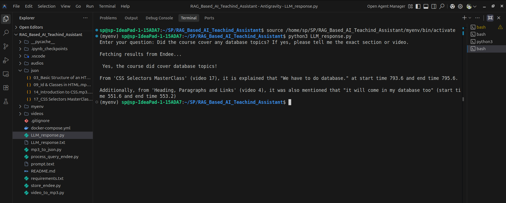
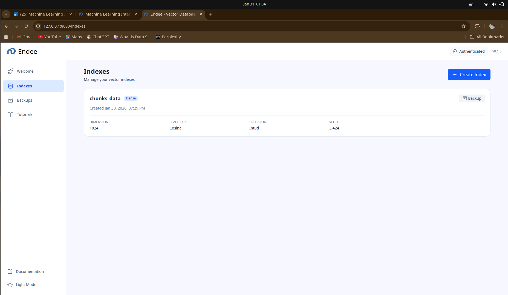

# RAG-Based AI Teaching Assistant (Endee Vector DB + Ollama)

## 1) Overview / Problem Statement

Video tutorials are one of the best ways to learn technical topics, but students often struggle to quickly find specific answers inside long videos. Searching manually is time-consuming, and revisiting key concepts becomes difficult.

This project solves the problem using Retrieval-Augmented Generation (RAG) by transforming tutorial content into a searchable knowledge base. Users can ask questions in natural language, and the assistant responds using only the most relevant content from the trained material.

## 2) System Design / Technical Approach

### Architecture Overview
```
Video/Audio → Transcription → Chunking + Timestamping → Embeddings → Endee Vector DB
                                                        ↓
User Question → Embedding → Endee Semantic Search → Retrieved Chunks → LLM Answer
```

### Core Pipeline

**Content Ingestion**  
Extracts learning content and splits it into small chunks with timestamps.

**Embedding & Storage**  
Converts each chunk into an embedding using bge-m3 (1024-dim)  
Stores embeddings and metadata inside Endee Vector Database.

**Query & Retrieval**  
Converts user question into an embedding.  
Performs semantic vector search in Endee to retrieve top relevant chunks.

**Answer Generation**  
Sends retrieved chunks + user question to the LLM (llama3.2) for a human-friendly response.  
Provides source reference (title/number/time) when available.

## 3) How Endee is Used

Endee is used as the Vector Database in this project.

Endee stores:
- Vector embeddings for each learning chunk
- Metadata such as chunk text, title, timestamps, and source file

Endee enables:
- Fast semantic similarity search
- Top-k retrieval of relevant content for RAG-based answering
- Endee API endpoints used: `/api/v1/index/create`, `/api/v1/index/{INDEX_NAME}/vector/insert`, `/api/v1/index/{INDEX_NAME}/search`

## 4) Tech Stack

- **Vector DB**: Endee Server (Docker)
- **Embeddings**: Ollama (bge-m3)
- **LLM**: Ollama (llama3.2)
- **Programming Language**: Python 3.12+
- **Libraries**: requests, msgpack, tqdm

## 5) Setup Instructions

### Prerequisites
- Docker + Docker Compose
- Python 3.12+
- Ollama installed
- FFmpeg (for video processing): `sudo apt install ffmpeg` (Ubuntu/Debian) or `brew install ffmpeg` (macOS)

### Steps

**Clone repo**
```bash
git clone "https://github.com/Muragharajendra/RAG_Based_AI_Teaching_Assistant"
cd RAG_Based_AI_Teaching_Assistant
```

**Create and activate environment**
```bash
python3 -m venv myenv
source myenv/bin/activate
```

**Install dependencies**
```bash
pip install -r requirements.txt
```

**Prepare content (optional - demo data included)**
# If you have video files, place them in videos/ directory and run:
# NOTE: You must have 'ffmpeg' installed to run video_to_mp3.py
(e.g., sudo apt install ffmpeg)

python3 video_to_mp3.py  # Convert videos to MP3
python3 mp3_to_json.py   # Transcribe MP3 to JSON chunks
```

**Start Endee**
```bash
docker compose up -d
```

**Start Ollama + pull models**
```bash
ollama serve
```

In another terminal:
```bash
ollama pull bge-m3
ollama pull llama3.2
```

## 6) Run Instructions

### Ingest Data into Endee
> [!NOTE]
> For this demo execution, we are using a **limited set of JSON data** to demonstrate the functionality without processing large video files.

To process the JSON chunks and store them in the Endee Vector Database:
```bash
python3 store_endee.py
```

### Run the AI Assistant
To ask questions and get answers from the LLM based on the retrieved content:
```bash
python3 LLM_response.py
```

**Example Queries to Try:**
- "Did the course cover any database topics? If yes, please tell me the exact section or video."
- "What are selectors used for?"
- "What is HTML responsible for?"

### Test Retrieval Only (Optional)
To see what chunks are retrieved without generating an LLM response:
```bash
python3 process_query_endee.py
```

## 7) Conclusion

This project demonstrates a complete RAG-based AI Teaching Assistant using Endee Vector Database as the semantic retrieval layer. Endee stores chunk embeddings with metadata and enables fast similarity search to retrieve the most relevant learning content for each user query. This improves learning efficiency by providing accurate, context-based answers from trained material with clear source references.

## 8) Screenshots

### Example Output


### Endee Vector DB

